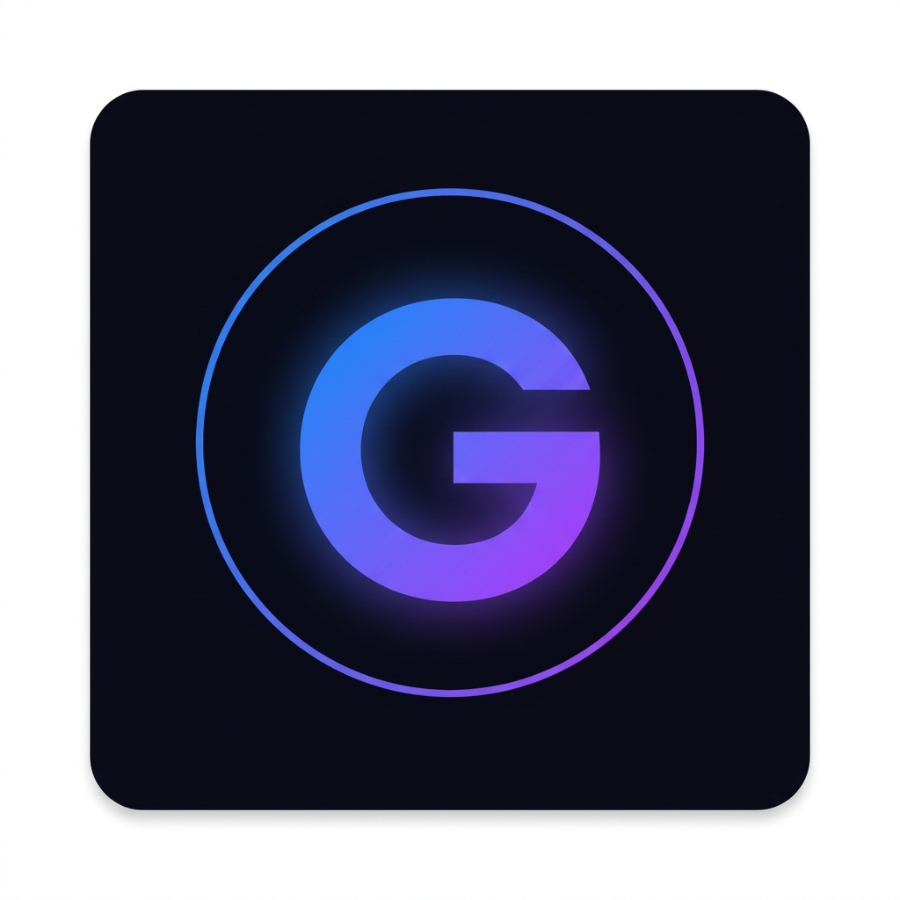

# Genesis — AI Browser Automation Assistant

[](https://github.com/Adityatex/Genesis/actions/workflows/ci.yml)

Open-source Brave/Chrome extension (Manifest V3) that injects a floating AI-powered sidebar into every webpage. Built with **WXT + React + TypeScript**. BYOK-only — no bundled keys.



## ✨ Features (v1: Agent + Autofill)

| Feature | Description |
|---|---|
| 🤖 **Autonomous Agent** | DOM snapshot → LLM planner → 10-action executor, resumes across navigations (20-step budget) |
| 📝 **Text Extraction** | Extract all visible text from any webpage using TreeWalker API |
| 🔍 **Element Detection** | Detect all interactive elements (inputs, buttons, dropdowns, etc.) |
| ✏️ **Trustworthy Form Auto-Fill** | Fill forms with *your own* profile data (React/Angular compatible). Edit it in the popup — stored only in `chrome.storage.local`. No exam auto-solving. |
| 📊 **Page Summarization** | AI-generated summaries of page content |
| 💡 **Text Explanation** | Select text and get AI-powered explanations |
| 💬 **Copilot Chat** | Free-form chat about the current page |

## 🛠️ Tech Stack

- **Framework:** [WXT](https://wxt.dev/) (Vite-powered browser extension framework)
- **UI:** React + TypeScript
- **Styling:** Tailwind CSS v4 with a dark glassmorphic theme
- **Testing:** Vitest + happy-dom, GitHub Actions CI (typecheck → test → build)
- **AI:** any OpenAI-compatible provider: Groq (default, `qwen/qwen3.8-27b`), DeepSeek, OpenAI, OpenRouter, local Ollama, or a custom server. Bring your own key
- **Architecture:** Manifest V3, Shadow DOM isolation, minimal permissions (`activeTab`, `scripting`, `storage`)

## 🚀 Getting Started

### Prerequisites
- Node.js 20.19+ (22 recommended)
- Brave or Chrome browser

### Development

```bash
# Install dependencies
npm install

# Start development mode (auto-opens browser with extension)
npm run dev

# Build for production
npm run build

# Package as ZIP for store submission
npm run zip
```

### Testing

```bash
npm run typecheck   # tsc --noEmit
npm test            # unit tests (Vitest + happy-dom)
npm run test:watch  # re-run on change
```

CI runs typecheck, tests and a production build on every push and pull request, and uploads the unpacked extension as a build artifact.

### Benchmark

`eval/` is an end-to-end harness. It loads the built extension into Chromium, gives the agent tasks on local test pages through the real sidebar, and grades them by the requests that actually reached the server.

```bash
npm run build
npm run eval:mock   # scripted planner, no API key (runs in CI)
npm run eval        # live against a real provider (Groq by default, --provider to change), reports success rate / LLM calls / tokens / time
```

The suite has 10 standard tasks (forms, dropdowns, radios, multi-page flows, slow backends, JS apps, extraction) and 5 hard ones aimed at known limits: long pages, custom widgets, iframes, Shadow DOM and rich-text editors. See [eval/README.md](eval/README.md).

**Baseline** (2026-09-25, Groq free tier, [full results](eval/BASELINE.md)):

| Model | Standard tasks | Hard tasks | Avg tokens / task |
|---|---|---|---|
| `qwen/qwen3.8-27b` (default) | 30/30 | 0/5 | 2,412 |
| `openai/gpt-oss-120b` | 30/30 | 0/5 | 3,141 |

The hard tasks fail because of how the agent sees and acts on the page, not because of the model. They're the targets for the next round of work.

### Loading in Browser

1. Run `npm run build`
2. Open `brave://extensions/` (or `chrome://extensions/`)
3. Enable **Developer mode** (top right toggle)
4. Click **Load unpacked**
5. Select the `.output/chrome-mv3` folder

## 📁 Project Structure

```
├── entrypoints/
│   ├── popup/              # Extension popup (API key management)
│   ├── sidebar.content/    # Content script with Shadow DOM sidebar
│   │   ├── App.tsx         # Thin composition shell (~180 lines)
│   │   ├── hooks/          # useChatMessages, useAgentLoop, useWorkspaceTools
│   │   ├── components/     # GenesisLogo, FloatingFab, Header, ToolsGrid, MessageList, ChatInput
│   │   └── sidebar.css     # Dark glassmorphic theme
│   └── background.ts      # Service worker (LLM API proxy, BYOK-only)
├── lib/
│   ├── api/                # Provider presets + OpenAI-compatible LLM client (BYOK)
│   ├── agent/              # DOM snapshot, action executor, action parser/validator, loop core
│   ├── automation/         # Trustworthy form autofill
│   ├── dom/                # DOM extraction & element detection
│   └── utils/              # Messaging, error handling, markdown
├── eval/                   # End-to-end benchmark (Playwright + fixture pages)
└── tests/                  # Vitest unit tests
```

## 🔐 AI provider and API key (BYOK)

Open the extension popup and pick a provider under **AI model**:

| Provider | Key | Notes |
|---|---|---|
| Groq (default) | [console.groq.com](https://console.groq.com/keys) | Free tier; default model `qwen/qwen3.8-27b` (see [baseline](eval/BASELINE.md)) |
| DeepSeek | [platform.deepseek.com](https://platform.deepseek.com/api_keys) | |
| OpenAI | [platform.openai.com](https://platform.openai.com/api-keys) | |
| OpenRouter | [openrouter.ai](https://openrouter.ai/keys) | Many models behind one key |
| Ollama (local) | none | Runs on your machine. Start Ollama with `OLLAMA_ORIGINS=chrome-extension://*` |
| Custom | optional | Any OpenAI-compatible `/chat/completions` server |

Paste your key, click **Load models** to list the models your key can actually use, pick one, and **Save**. Model names aren't hardcoded because providers retire them; Groq retired this project's original default. The client adapts to provider differences: if a server rejects JSON mode, `max_tokens` or `temperature`, it adjusts the request and retries.

Keys are stored per provider in `chrome.storage.local` and read only by the background service worker. They are never exposed to content scripts, never shown back in full, and never committed. Keys and page content are only sent over HTTPS, except to servers on localhost. See [PRIVACY.md](PRIVACY.md).

## 📄 License

MIT
